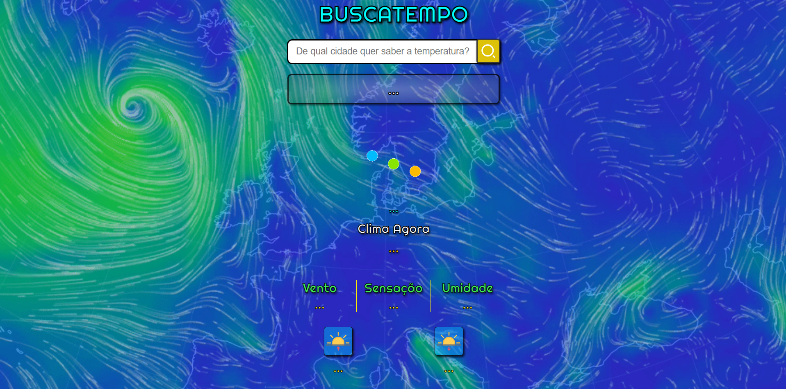

# Buscatempo - Informativo de Clima

Deploy: https://buscatempo-rho.vercel.app/

## Sobre

É um site que ao escrever o nome de sua cidade ele lhe dará com detalhes informações sobre o clima, temperatura, sensação térmica, umidade do ar, velocidade do vento e horário em que o sol nasce e se põe.

### Objetivo

Aprimorar meus conhecimentos de front-end. É mais um aplicativo de ajuda a ser incluído nas ferramentas de auxílio para o dia a dia que venho desenvolvendo.

### Desafio

Mais uma vez entender como funciona o Javascript e desta vez aprimorando meus conhecimentos sobre API´s. Neste caso é um de previsão do tempo o OpenWeather (https://openweathermap.org/).

### Conclusão

Foi muito prazeroso desenvolver esta ferramenta de previsão do tempo, foi bem tranquilo de configurar o CSS e o Javascript. Continuarei a trabalhar no próximo projeto com mais ferramentas que possam auxiliar as pessoas no dia a dia.

### Ferramentas Utilizadas

- HTML
- CSS
- JavaScript